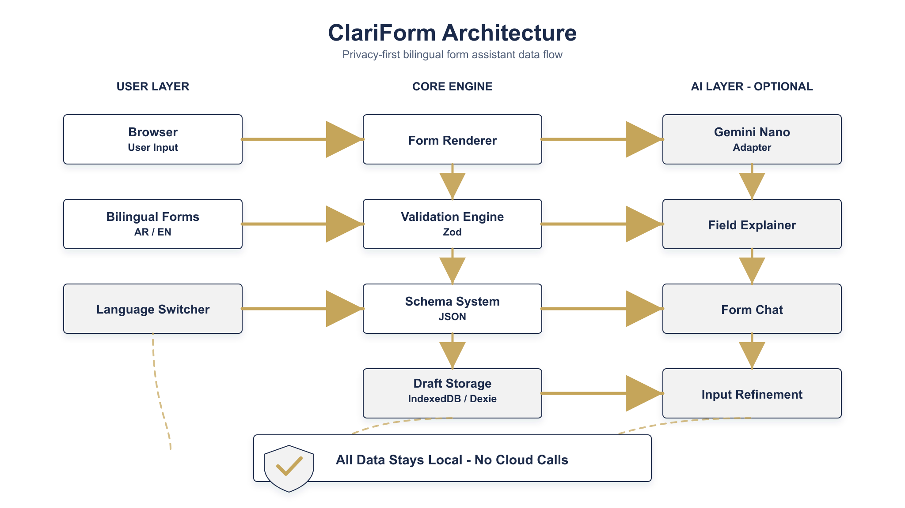

<!DOCTYPE html>
<html lang="en">
<head>
  <meta charset="UTF-8">
  <meta name="viewport" content="width=device-width, initial-scale=1.0">
  <title>ClariForm - Private Bilingual Form Assistant</title>
  
</head>
<body>

  <!-- Header -->
  

    
    <h1>ClariForm</h1>
    
Private bilingual form assistance directly in the browser

    
Mohamed Yasser | Solutions Architect

  

  <!-- Overview -->
  <h2>Overview</h2>
  

    ClariForm is a browser-based Arabic/English form assistant that helps users understand fields,
    fill structured forms, validate inputs, and receive AI-powered guidance — all without sending
    personal data to the cloud. Built with privacy at its core, ClariForm processes everything
    locally and integrates with Chrome's on-device Gemini Nano when available.
  

  

    v1.0.0
    Privacy-First
    Bilingual AR/EN
    Offline PWA
  

  <!-- Key Features -->
  <h2>Key Features</h2>
  

    

      <strong>Privacy-First</strong>
      All processing happens locally in the browser. No personal data ever leaves your device.
    

    

      <strong>Bilingual Support</strong>
      Full Arabic and English UI with seamless RTL/LTR switching and localized validation messages.
    

    

      <strong>Schema-Driven Forms</strong>
      Dynamic form rendering from JSON schemas with bilingual labels and type-specific constraints.
    

    

      <strong>Local Validation</strong>
      Deterministic Zod validation rules as the source of truth — never AI-dependent.
    

    

      <strong>Gemini Nano Integration</strong>
      On-device AI for field explanation, chat assistance, and input refinement when available.
    

    

      <strong>Offline Capable</strong>
      Full PWA support with service workers and IndexedDB for offline draft persistence.
    

  

  <!-- Architecture -->
  <h2>Architecture</h2>
  

    ClariForm follows a local-first architecture with a clear three-layer separation. All form
    data stays in the browser, validation runs deterministically, and AI assistance is optional
    and privacy-guarded.
  

  

  

    
&#128737;

    
All data stays local — no cloud calls, no external API requests, no data leaks.

  

  <!-- Tech Stack -->
  <h2>Tech Stack</h2>
  <table>
    <thead>
      <tr>
        <th>Layer</th>
        <th>Technology</th>
      </tr>
    </thead>
    <tbody>
      <tr><td>Framework</td><td>React 19 + TypeScript 6</td></tr>
      <tr><td>Bundler</td><td>Vite 8</td></tr>
      <tr><td>Styling</td><td>Tailwind CSS 4</td></tr>
      <tr><td>Schema Validation</td><td>Zod 4</td></tr>
      <tr><td>Local Database</td><td>Dexie (IndexedDB)</td></tr>
      <tr><td>AI Integration</td><td>Chrome Built-in AI Prompt API / Gemini Nano</td></tr>
      <tr><td>PWA</td><td>vite-plugin-pwa (Workbox)</td></tr>
      <tr><td>Unit Testing</td><td>Vitest + Testing Library</td></tr>
      <tr><td>E2E Testing</td><td>Playwright (Chromium)</td></tr>
      <tr><td>Linting</td><td>oxlint</td></tr>
    </tbody>
  </table>

  <!-- Privacy Model -->
  <h2>Privacy Model</h2>
  <ul>
    <li><strong>Zero cloud dependencies</strong> — all form data stays in the browser</li>
    <li><strong>Sensitive field detection</strong> — Emirates ID, passport, mobile, email auto-redacted from AI prompts</li>
    <li><strong>Prompt audit log</strong> — every AI request is logged with redaction status</li>
    <li><strong>Validation as source of truth</strong> — deterministic rules, never AI-generated</li>
    <li><strong>Gemini Nano on-device</strong> — AI runs locally via Chrome's built-in API</li>
  </ul>

  <!-- Sample Forms -->
  <h2>Sample Forms</h2>
  

    

      <strong>Individual Profile</strong>
      Personal info, Emirates ID, contact, document checklist — 3 sections
    

    

      <strong>Business Registration</strong>
      Company details, trade license, owner info, documents — 3 sections
    

    

      <strong>Service Request</strong>
      Requester info, service type, supporting documents — 3 sections
    

  

  <!-- Getting Started -->
  <h2>Getting Started</h2>
  <pre><code># Install dependencies
npm install

# Start development server
npm run dev

# Run unit tests (87 tests)
npm run test

# Run e2e tests (8 tests)
npm run test:e2e

# Build for production
npm run build</code></pre>

  <!-- Development -->
  <h2>Development</h2>
  <table>
    <thead>
      <tr>
        <th>Command</th>
        <th>Description</th>
      </tr>
    </thead>
    <tbody>
      <tr><td><code>npm run dev</code></td><td>Start Vite dev server</td></tr>
      <tr><td><code>npm run build</code></td><td>Type-check + production build</td></tr>
      <tr><td><code>npm run test</code></td><td>Run Vitest unit tests</td></tr>
      <tr><td><code>npm run test:e2e</code></td><td>Run Playwright e2e tests</td></tr>
      <tr><td><code>npm run lint</code></td><td>Run oxlint linter</td></tr>
    </tbody>
  </table>

  <!-- Project Structure -->
  <h2>Project Structure</h2>
  <pre><code>src/
├── components/       # React UI components (FormRenderer, ReviewPage, etc.)
├── schema/           # FormSchema types &amp; Zod validation
├── forms/            # Bilingual form definitions (3 sample forms)
├── validation/       # Field-level validation engine
├── i18n/             # Arabic/English translations &amp; RTL support
├── db/               # IndexedDB draft persistence (Dexie)
├── nano/             # Gemini Nano capability detection &amp; adapter
├── assistant/        # AI field explanation
├── chat/             # AI form Q&amp;A chat
├── refine/           # AI input refinement (non-sensitive fields)
├── missing/          # Missing information detection
└── privacy/          # Sensitive field redaction &amp; audit log</code></pre>

  <!-- Footer -->
  

    MY &nbsp;|&nbsp; Mohamed Yasser | Solutions Architect
  

</body>
</html>
